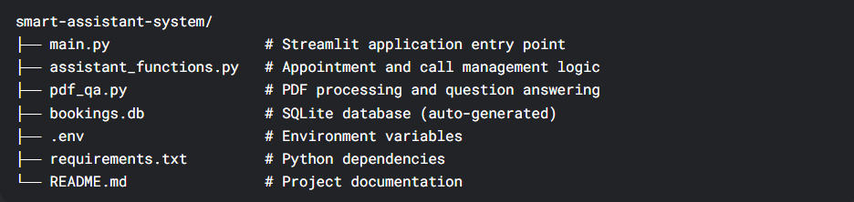
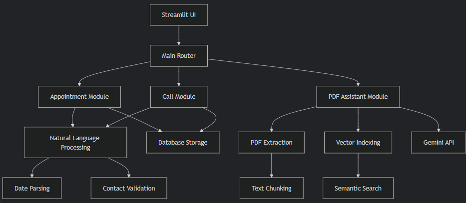

# Smart Assistant System - CLI Edition

The Smart Assistant System CLI is a powerful command-line solution that combines appointment scheduling, call request management, and PDF document analysis. This Python-based system helps businesses and individuals streamline their scheduling processes while providing advanced document analysis capabilities directly from the terminal.

## Key Features

### 💼 Appointment & Call Management
- Natural language conversation interface
- Future date parsing with intelligent suggestions
- Contact validation (phone, email)
- SQLite database storage
- Confirmation workflow with user verification

### 📄 PDF Document Intelligence
- PDF text extraction with semantic chunking
- FAISS vector indexing for efficient search
- Gemini API integration for advanced question answering
- Context-aware responses with source tracing
- Daily API quota tracking

### ⚙️ CLI Advantages
- Lightweight and fast execution
- No GUI dependencies
- Scriptable and automatable workflows
- Resource-efficient operation
- Cross-platform compatibility

## Installation Guide

### Prerequisites
- Python 3.11+
- pip package manager

### Step-by-Step Installation
```bash
# Clone the repository
git clone https://github.com/Dibij/smart-assistant-system.git
cd smart-assistant-system

# Create a virtual environment (recommended)
python -m venv venv
source venv/bin/activate  # On Windows: venv\Scripts\activate

# Install dependencies
pip install -r requirements.txt

# Set up environment variables
echo "GEMINI_API_KEY=your_api_key_here" > .env
```

### Required Packages
The `requirements.txt` file includes:
```
sqlite3
dateparser
python-dotenv
pdfminer.six
faiss-cpu
sentence-transformers
requests
numpy
```

## Configuration

### Environment Variables
Create a `.env` file in the root directory with your Gemini API key:
```
GEMINI_API_KEY=your_api_key_here
```

### Database Setup
The system automatically creates and manages a SQLite database (`bookings.db`) with the following tables:
1. `call_requests` - Stores call request details
2. `appointments` - Stores appointment details

## Usage Guide

### Starting the Application
```bash
python main.py
```

### Command Line Interface Navigation
```
============================================================
Welcome to the Assistant System!
You can request assistance with:
  - Appointments (say 'appointment' or 'book')
  - Call requests (say 'call' or 'phone')
  - PDF documents (say 'pdf' or 'document')
Type 'exit' to quit at any time
============================================================

How can I help you?
```

### Workflow Examples

#### Booking an Appointment
1. Start the application
2. Type "I want to book an appointment"
3. Follow the conversational prompts:
   - Provide your name
   - Enter your phone number
   - Enter your email
   - Specify appointment time (e.g., "next Tuesday at 2pm")
   - Confirm details

#### Analyzing a PDF Document
1. Start the application
2. Type "I have a question about a PDF"
3. Provide the PDF path when prompted
4. Ask questions about the document content:
   - "What are the key findings?"
   - "Summarize the methodology section"
   - "List all recommendations"
5. Type "back" to return to main menu

## Project Structure


## System Architecture



## API Integration

The PDF Assistant module integrates with Google's Gemini API for advanced natural language processing. Key implementation details:

- **Endpoint**: `https://generativelanguage.googleapis.com/v1beta/models/gemini-1.5-flash:generateContent`
- **Authentication**: API key via `GEMINI_API_KEY` environment variable
- **Quota Management**: 500 free requests per day
- **Prompt Engineering**: Context-aware queries with extracted PDF content

## Contributing

We welcome contributions to the Smart Assistant System! Here's how to get started:

1. Fork the repository
2. Create a new branch for your feature (`git checkout -b feature/your-feature`)
3. Commit your changes (`git commit -am 'Add some feature'`)
4. Push to the branch (`git push origin feature/your-feature`)
5. Create a new Pull Request

### Areas for Contribution
- Add calendar integration (Google Calendar, Outlook)
- Implement email/SMS notifications
- Develop reporting and analytics features
- Enhance PDF processing for scanned documents
- Add multilingual support
- Create batch processing capabilities

## License

This project is licensed under the MIT License - see the [LICENSE](LICENSE) file for details.

## Support

For questions, issues, or feature requests, please open an issue on our [GitHub repository](https://github.com/Dibij/smart-assistant-system).

---

**Smart Assistant System CLI** © 2023 - Streamline your scheduling and document analysis with AI-powered efficiency through the command line.
